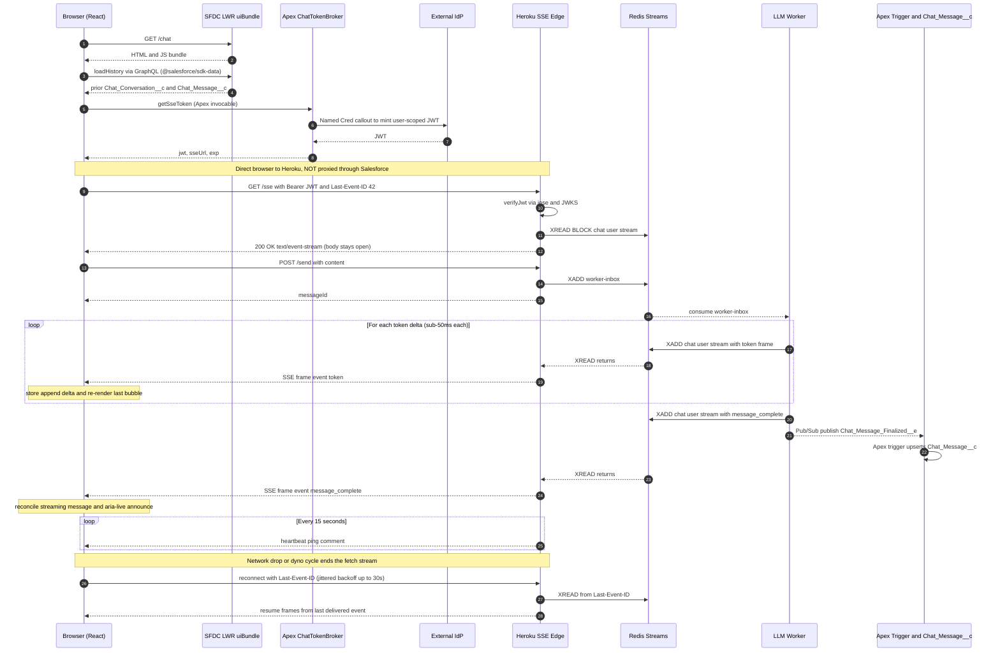

# Salesforce Chat UI over External SSE

A Salesforce-embedded React chat UI that streams responses from an external Server-Sent Events (SSE) edge, designed to scale to 10,000+ concurrent users. Three pillars:

- **React 19 uiBundle** served by Salesforce LWR (Experience Cloud) for the chat UI.
- **Stateless Fastify SSE edge** on Heroku, fronting a worker pool.
- **Redis Streams** as the fan-out bus between workers and the edge — no sticky sessions, horizontal scale by adding dynos.

Finalized messages are persisted to Salesforce custom objects via Platform Events; hot streaming state lives in Heroku Postgres.

## Solution Architecture

### High-level component view

```
┌─────────────────────────── Salesforce (LWR / Experience Cloud) ────────────────────────────┐
│                                                                                            │
│   Browser (end user)                                                                       │
│   ┌──────────────────────────────────────────────────────────────────────────────┐         │
│   │  React uiBundle  (force-app/main/default/uiBundles/myreactapp)               │         │
│   │    /chat route                                                               │         │
│   │    ┌──────────────┐  ┌──────────────┐  ┌──────────────────────────────────┐  │         │
│   │    │  ChatView    │  │  useSSE      │  │  chatStore (Zustand)             │  │         │
│   │    │  (virtual.)  │◄─┤ fetchEventS. │◄─┤  messages / streamingId / status │  │         │
│   │    └──────▲───────┘  └──────▲───────┘  └──────────────────────────────────┘  │         │
│   │           │ send msg        │ stream tokens                                  │         │
│   │    ┌──────┴────────────┐    │                                                │         │
│   │    │ chatClient.ts     │    │                                                │         │
│   │    │  - sendMessage()  │    │                                                │         │
│   │    │  - getSseToken()  │    │                                                │         │
│   │    │  - loadHistory()  │    │                                                │         │
│   │    └────┬──────────┬───┘    │                                                │         │
│   │         │ GraphQL  │ Apex   │ HTTPS (Bearer JWT)                             │         │
│   └─────────┼──────────┼────────┼────────────────────────────────────────────────┘         │
│             │          │        │                                                          │
│   ┌─────────▼──────────▼────┐   │        CSP Trusted URL allows connect-src                │
│   │  @salesforce/sdk-data   │   │                                                          │
│   │  (GraphQL + Apex)       │   │                                                          │
│   └─────────┬──────────┬────┘   │                                                          │
│             │          │        │                                                          │
│   ┌─────────▼──┐  ┌────▼──────────────┐   ┌─────────────────────────────┐                  │
│   │ GraphQL    │  │ Apex              │   │  Platform Event             │                  │
│   │ (history   │  │ ChatTokenBroker   │   │  Chat_Message_Finalized__e  │                  │
│   │  read)     │  │  mintToken()      │   │  + Trigger -> Writer        │                  │
│   └────┬───────┘  └─────┬─────────────┘   └──────────▲──────────────────┘                  │
│        │                │                            │                                     │
│   ┌────▼────────────────▼────────────────────────────┴──────────────────┐                  │
│   │  Custom Objects                                                     │                  │
│   │   Chat_Conversation__c                                              │                  │
│   │   Chat_Message__c                                                   │                  │
│   │   (planned: Big Object Chat_Message_Archive__b — see "Future")      │                  │
│   └─────────────────────────────────────────────────────────────────────┘                  │
│                          │                                                                 │
│                          │ Named Credential + External Credential                          │
│                          ▼                                                                 │
└──────────────────────────┼─────────────────────────────────────────────────────────────────┘
                           │ (JWT mint)                                      ▲ publish on
                           │                                                 │ message_complete
                           ▼                                                 │
┌──────────────────── External / Cloud (team-owned) ─────────────────────────┼──────────────┐
│                                                                            │              │
│   ┌─────────────┐   ┌──────────────────┐     ┌─────────────────────┐       │              │
│   │  IdP /      │   │  CloudFront /    │     │  SSE Edge (Node/Go) │       │              │
│   │  JWT mint   │   │  ALB  (HTTP/2)   │────▶│  stateless          │───────┘              │
│   └─────────────┘   └──────────▲───────┘     │  - auth verify      │                      │
│                                │             │  - heartbeat        │                      │
│                       Browser  │             │  - backpressure     │                      │
│                     GET /sse   │             └─────┬──────┬────────┘                      │
│                  (Bearer JWT)  │                   │      │                               │
│                                │                   │      │ subscribe                     │
│                                │      ┌────────────▼───┐  │                               │
│                                │      │  POST /send    │  │                               │
│                                │      │  (REST)        │  │                               │
│                                │      └─────────┬──────┘  │                               │
│                                │                │         │                               │
│                                │          ┌─────▼─────────▼──────────┐                    │
│                                │          │  Event bus               │                    │
│                                │          │  NATS JetStream /        │                    │
│                                │          │  Redis Streams           │                    │
│                                │          └─────▲────────────────────┘                    │
│                                │                │ publish                                 │
│                                │          ┌─────┴──────────────┐                          │
│                                │          │ LLM / App workers  │                          │
│                                │          │ (producers)        │                          │
│                                │          └────────┬───────────┘                          │
│                                │                   │ writes finalized state               │
│                                │          ┌────────▼───────────┐                          │
│                                │          │ Hot DB             │                          │
│                                │          │ (Postgres/DynamoDB)│                          │
│                                │          └────────────────────┘                          │
│                                │                                                          │
│             Observability: Prometheus / Grafana / Loki                                    │
└───────────────────────────────────────────────────────────────────────────────────────────┘
```

### How the React UI gets notified from the SSE edge

The browser holds **one long-lived HTTPS connection** directly from the user's browser (running the React uiBundle served by Salesforce LWR) to the Heroku-hosted SSE edge. **Salesforce is NOT a relay.** The edge pushes bytes into that open connection; the browser parses each frame and updates the React store.

**Sequence Diagram (Mermaid Notation):**



**Key facts the diagram makes explicit:**

1. The browser opens a **direct TLS connection to Heroku** (`sse.mycompany.com`). Salesforce is in the picture only for serving the JS bundle, GraphQL history reads, and minting the JWT.
2. **Salesforce lets the browser go to Heroku** because of the **CSP Trusted URL** (`connect-src https://sse.mycompany.com`) and Heroku's CORS allow-list including the LWR site origin.
3. The connection is **opened by the browser** and stays open. The edge writes into the open response body whenever Redis Streams delivers a new event for that user. Each `\n\n`-terminated frame triggers `fetchEventSource`'s `onmessage` callback synchronously.
4. **No polling**, **no webhook into Salesforce for tokens**, **no Platform Event involved in the live UI path.** Platform Events only fire on `message_complete` for persistence.
5. **Reconnect** is initiated by the browser when the fetch stream ends; the edge resumes from `Last-Event-ID` against Redis Streams, so no tokens are lost across dyno cycles or network blips.

### Runtime flows

**A. Open chat (cold load)**

1. User navigates to `/chat` in the LWR site.
2. React uiBundle mounts → calls GraphQL via `@salesforce/sdk-data` to load last N `Chat_Conversation__c` + `Chat_Message__c` for current user.
3. Calls `ChatTokenBroker.mintToken()` via Apex → returns `{jwt, sseUrl, exp}`.
4. `useSSE` opens `GET {sseUrl}` with `Authorization: Bearer {jwt}` and last known `Last-Event-ID`.
5. Edge authenticates JWT, subscribes to the user's subject on the event bus, starts forwarding frames.

**B. Send message + stream response**

1. User submits input → optimistic `{role:'user', status:'pending'}` appended to store.
2. `POST /send` to external REST with JWT → returns `messageId`.
3. LLM worker publishes token deltas to event bus keyed by `userId`.
4. Edge forwards frames as SSE → browser store appends to `streamingMessage` ref; only the last bubble re-renders.
5. Worker emits `message_complete` frame **and** publishes Platform Event to Salesforce.
6. Apex trigger (`ChatMessageFinalizedTrigger`) → `ChatMessageWriter` upserts `Chat_Message__c` + rolls `Chat_Conversation__c.Ended_At__c`.

**C. Reconnect**

1. Connection drops (network / Safari bfcache / 45s idle with no ping).
2. `useSSE` backs off (1 → 30s, jittered), refreshes token if expired.
3. Reconnect sends `Last-Event-ID` → edge resumes from last event in the bus.

### How the client knows when the edge publishes — push, not poll

SSE is one long-lived HTTP response whose body is never closed. The edge writes `data:` frames into that same response as events occur; the browser's `ReadableStream` parser fires a callback the instant a frame's terminating blank line arrives.

Frame shape (wire envelope):

```
id: 44
event: token
data: {"delta":" world"}

id: 45
event: message_complete
data: {"messageId":"abc"}

: ping
```

Each frame ends with a blank line (`\n\n`) — that delimiter is the "deliver now" signal.

Event-type routing (single stream, multiple semantics):

| `event:`           | Meaning                 | Client behavior                                                       |
| ------------------ | ----------------------- | --------------------------------------------------------------------- |
| `token`            | partial delta           | append to `streamingMessage` ref; only last bubble re-renders         |
| `message_complete` | assistant message final | move into `messages[]`; fire aria-live; reconcile w/ Salesforce write |
| `tool_call`        | tool triggered          | render tool-call card                                                 |
| `error`            | server-side error       | show banner; keep connection                                          |
| `ping` (comment)   | heartbeat               | reset idle watchdog; not surfaced to app                              |

Why the push works end-to-end:

- Edge is subscribed to a per-user subject on NATS/Redis Streams; bus routes to whichever pod holds that user's connection — **no sticky sessions** required.
- Edge calls `res.write(frame)` then flushes immediately (disable Nagle / buffering).
- ALB idle timeout 600s; HTTP/2 multiplexing; heartbeat every 15s keeps LB/CDN from cutting "idle" conns.
- Every frame has `id:` → client echoes `Last-Event-ID` on reconnect so the bus replays from the last delivered event.

Failure detection client-side:

- Clean close / network drop → fetch stream ends → backoff + reconnect with `Last-Event-ID`.
- No pings for 45s → client watchdog aborts → reconnect.
- 401 mid-stream → refresh JWT via `ChatTokenBroker` → reconnect.

### Browser ↔ Platform Events: not the same channel

`fetchEventSource` **does not** subscribe to Salesforce Platform Events. The two paths are independent:

- **Browser real-time path:** worker → Redis Streams → SSE edge → `fetchEventSource`. Tokens, completions, errors flow here. Sub-50ms latency, no per-message Salesforce cost.
- **Salesforce persistence path:** worker → Platform Event → Apex trigger → `Chat_Message__c`. Used only for finalized messages, never per token.

Why not feed the browser from Platform Events directly?

- Platform Events ride **CometD long-polling** or the server-side **Pub/Sub gRPC API** — neither is consumable by `EventSource` or `fetchEventSource`.
- **Daily delivery caps** would be exhausted by token volume at 10K users.
- **Latency** of CometD (~250ms+) is unsuitable for token streaming.

If a Platform Event must reach the live UI (e.g., presence, external system signals): the edge subscribes to Platform Events via Pub/Sub gRPC server-side and republishes relevant events onto the user's Redis Streams subject, so the browser sees them as a normal SSE frame. Client code is unchanged.

```
Salesforce ──▶ Pub/Sub gRPC ──▶ SSE Edge ──▶ Redis Streams (chat:user:<id>) ──▶ Browser
```

### Deployment view

| Layer         | What                                    | Where                    | Scale unit                                  |
| ------------- | --------------------------------------- | ------------------------ | ------------------------------------------- |
| Client        | React uiBundle                          | Salesforce LWR CDN       | per-user browser                            |
| SFDC platform | Apex broker + triggers + custom objects | Salesforce org           | per-org governor limits                     |
| Edge          | Stateless SSE service (Node 22 or Go)   | Heroku (Fir) / k8s / ECS | horizontal; ~2K active / ~10K idle per dyno |
| Bus           | NATS JetStream / Redis Streams          | Managed cluster          | 3-node quorum min                           |
| Producers     | LLM / chat workers                      | Heroku worker dyno / ASG | horizontal                                  |
| Hot DB        | Postgres or DynamoDB                    | Managed                  | reads+writes scale-out                      |
| Observability | Prometheus + Grafana + Loki             | Shared cluster           | —                                           |

### Security boundaries

- **Browser ↔ Salesforce:** existing LWR session; `@AuraEnabled` gated by `ChatUser` permission set.
- **Browser ↔ External Edge:** JWT Bearer (user-scoped, 5-min TTL) over TLS; CSP Trusted URL allows `connect-src`; CORS allow-list includes the LWR site origin.
- **Salesforce ↔ IdP:** Named Credential + External Credential (client secret server-side only).
- **Edge ↔ Bus ↔ Workers:** mTLS or VPC-internal; JWT re-verified at the edge on every connect.
- **Salesforce custom objects:** with-sharing Apex, FLS enforced, optional Shield encryption on `Content__c`.

### Technology choices summary

| Concern               | Choice                                     | Reason                                          |
| --------------------- | ------------------------------------------ | ----------------------------------------------- |
| UI framework          | React 19 uiBundle (existing)               | Streaming UX; tooling already wired             |
| SSE transport         | `@microsoft/fetch-event-source`            | Custom headers, `Last-Event-ID`, reconnect      |
| State                 | Zustand                                    | Minimal re-renders for token streams            |
| Virtualization        | `@tanstack/react-virtual`                  | Dynamic message heights                         |
| Auth broker           | Apex + Named Credential                    | Client secret never in browser                  |
| Edge                  | Node 22 (Fastify)                          | High conn/dyno, HTTP/2 at router                |
| Bus                   | Redis Streams (Heroku) / NATS JetStream    | Low-latency fan-out                             |
| Hot DB                | Postgres (Heroku)                          | OLTP write-heavy; Salesforce is not             |
| Persistence of record | `Chat_Conversation__c` + `Chat_Message__c` | CRM linkage, sharing, audit                     |
| Archive (planned)     | Big Object `Chat_Message_Archive__b`       | Cheap long-term retention — not yet implemented |

## Monorepo layout

```
my-react-project/
├── force-app/main/default/
│   ├── uiBundles/myreactapp/           React 19 + Vite + Tailwind + shadcn chat UI (LWR)
│   │                                   (workspace name: base-react-app — used by `pnpm --filter`)
│   ├── classes/                        ChatTokenBroker, ChatMessageWriter, tests
│   ├── objects/                        Chat_Conversation__c, Chat_Message__c,
│   │                                   Chat_Message_Finalized__e, Chat_Settings__mdt
│   ├── triggers/                       ChatMessageFinalizedTrigger
│   ├── connectedApps/                  SSEEdgeChat — OAuth/JWT-bearer client used by
│   │                                   ChatTokenBroker and the llm-worker Platform Event publisher
│   ├── cspTrustedSites/                Allows browser → Heroku connect-src
│   ├── namedCredentials/ + externalCredentials/   IdP token mint (server-side secret)
│   └── permissionsets/                 ChatUser
├── apps/
│   ├── sse-edge/                       Fastify SSE edge — Heroku web dyno
│   ├── echo-worker/                    Smoke-test worker (echoes user input)
│   └── llm-worker/                     Production worker — Google Gemini via @google/genai
├── packages/
│   └── chat-protocol/                  Shared TS types for the SSE wire envelope
├── .github/workflows/                  CI + deploy lanes (see .github/workflows/README.md)
├── pnpm-workspace.yaml
└── package.json                        Workspace scripts (dev:*, build:*, deploy:edge)
```

`packages/chat-protocol` is the single source of truth for the wire format. Both the React uiBundle and the Heroku apps import from `@chat/protocol` — wire-format drift becomes a compile error, not a 3 a.m. surprise.

`Chat_Settings__mdt` is a Custom Metadata Type that holds runtime configuration (SSE URL, JWT audience) read by `ChatTokenBroker`. The `SSEEdgeChat` Connected App backs both the user-scoped JWTs minted for the browser and the Client-Credentials token used by `llm-worker` to publish `Chat_Message_Finalized__e`.

## Wire envelope

```ts
export type ChatFrame =
  | { id: string; type: "token"; data: { messageId: string; delta: string } }
  | {
      id: string;
      type: "message_complete";
      data: { messageId: string; tokens: number };
    }
  | { id: string; type: "tool_call"; data: { name: string; args: unknown } }
  | { id: string; type: "error"; data: { code: string; message: string } };

export interface SendMessageRequest {
  conversationId: string;
  content: string;
}
export interface SendMessageResponse {
  messageId: string;
}
```

Each frame carries an `id`; the client echoes `Last-Event-ID` on reconnect so the bus replays from the last delivered event. Token frames may be dropped under backpressure; discrete events (`message_complete`, `tool_call`, `error`) never are.

## Getting started

```bash
pnpm install                # from repo root

pnpm dev:ui                 # React uiBundle (Vite dev server)
pnpm dev:edge               # Fastify SSE edge (tsx watch)
pnpm dev:worker:echo        # local echo worker — proves the pipe end-to-end
pnpm dev:worker:llm         # Gemini worker (requires GOOGLE_API_KEY, SF_* env vars)
```

The edge and workers both expect a Redis on `REDIS_URL` (default `redis://localhost:6379`). The `llm-worker` additionally needs Postgres on `DATABASE_URL` and Salesforce Connected App credentials — see [apps/llm-worker/README.md](apps/llm-worker/README.md).

Salesforce metadata is deployed with the standard CLI:

```bash
sf project deploy start -d force-app
```

## Deploying

**Salesforce side.** `sf project deploy start -d force-app` ships Apex, custom objects, triggers, the CSP Trusted Site, and the Named Credential. Experience Builder Trusted URLs are per-site and **not** captured by DX metadata — confirm `connect-src` includes the SSE edge's custom domain after every deploy to a new org/site.

**Heroku side.** `pnpm deploy:edge` builds the SSE edge and the worker into one combined slug and force-pushes it to the `heroku` git remote. The slug's `Procfile` declares both `web` and `worker` process types so they share one Redis add-on. Worker mode (`echo` vs `llm`) is a config-var change, not a redeploy. One-time app/add-on setup and the `WORKER_MODE` switch are documented in [apps/sse-edge/README.md](apps/sse-edge/README.md) and [apps/llm-worker/README.md](apps/llm-worker/README.md).

## Persistence model

- **Hot state — Heroku Postgres.** Recent conversation turns the worker needs for prompt history. All streaming writes land here.
- **System of record — Salesforce.** On `message_complete`, the worker publishes `Chat_Message_Finalized__e`; an Apex trigger upserts `Chat_Message__c` (one row per finalized message, never per token) and rolls `Chat_Conversation__c.Ended_At__c`. CRM linkage, sharing rules, FLS, Shield encryption, audit trail come for free.

This split keeps token-rate writes off the Salesforce platform (governor limits, $/GB) while still making finalized chats reportable and linkable to Contacts/Cases.

## Future implementation

The original architecture plan included pieces that are **not yet shipped**. They make sense and are worth tracking, but no code/metadata exists for them today:

- **Big Object archive `Chat_Message_Archive__b`** — for >90-day retention of finalized messages, offloading older `Chat_Message__c` rows to cheap long-term storage. No metadata file exists in [force-app/main/default/objects/](force-app/main/default/objects/).
- **Tool-call rendering UI** — the wire envelope already supports `tool_call` frames and the Zustand store [stores/chatStore.ts:95](force-app/main/default/uiBundles/myreactapp/src/stores/chatStore.ts#L95) has a comment noting "not handled in MVP store." Renderable tool-call cards (name, args, result) still need to be designed.
- **End-to-end Playwright tests** — referenced in the plan as `tests/e2e/chat.spec.ts` with a local Node SSE mock. No Playwright config or `e2e/` directory exists in the uiBundle yet.
- **k6 + xk6-sse load test** — to validate the 10K-concurrent-stream SLO (p99 first-token < 500 ms, reconnect rate < 0.5%/min). No load-test scripts in the repo.
- **Edge-side rate limiting** — plan calls for "1 open stream/user, 50 sends/min/user" via a Redis token bucket. `MAX_CONN_PER_USER=1` is set in [apps/sse-edge/app.json](apps/sse-edge/app.json) but no enforcement code exists in [apps/sse-edge/src/](apps/sse-edge/src/) yet.
- **Pub/Sub gRPC bridge for Platform Events into the live UI** — design path for relaying selected Salesforce Platform Events (presence, external signals) onto Redis Streams so the browser sees them as normal SSE frames. Not implemented.
- **NATS JetStream as an alternative to Redis Streams** — the architecture diagram shows it as an option for lower-latency fan-out. Current implementation uses Redis Streams only.

## Where to read more

- [apps/sse-edge/README.md](apps/sse-edge/README.md) — Heroku slug layout, deploy script, scaling.
- [apps/echo-worker/README.md](apps/echo-worker/README.md) — local-dev worker, env vars.
- [apps/llm-worker/README.md](apps/llm-worker/README.md) — Gemini worker, Connected App setup, `WORKER_MODE` switch.
- [Salesforce Extensions Documentation](https://developer.salesforce.com/tools/vscode/)
- [Salesforce DX Developer Guide](https://developer.salesforce.com/docs/atlas.en-us.sfdx_dev.meta/sfdx_dev/sfdx_dev_intro.htm)
